<div align="center">


# PWRS (PoWerRuSt)

**Rust bindings for PowerShell binary modules, in the spirit of PyO3.**

[](https://crates.io/crates/PoWerRuSt)
[](https://docs.rs/PoWerRuSt)
[](https://github.com/Variably-Constant/PWRS/blob/main/LICENSE)
[](https://learn.microsoft.com/powershell/)
[](https://dotnet.microsoft.com/)

**[Documentation](https://variably-constant.github.io/PWRS/)** | [Getting started](https://variably-constant.github.io/PWRS/docs/tutorials/getting-started/) | [API reference](https://docs.rs/PoWerRuSt) | [Changelog](https://github.com/Variably-Constant/PWRS/blob/main/CHANGELOG.md)

A cmdlet is a Rust struct and its fields are the parameters, coerced and validated by PowerShell's own binder before your code runs. `cargo pwrs build` turns the crate into a module folder `Import-Module` loads in PowerShell 7 from 7.4 on and in Windows PowerShell 5.1. No .NET SDK is installed anywhere: the C# compiler is fetched once and runs on the runtime pwsh already ships.

</div>

---

<details>
<summary><b>Table of contents</b></summary>

- [Features](#features)
- [Quick start](#quick-start)
- [Why PWRS](#why-pwrs)
- [A module built with it](#a-module-built-with-it)
- [What a module can do](#what-a-module-can-do)
- [Types across the boundary](#types-across-the-boundary)
- [Architecture](#architecture)
- [The call path](#the-call-path)
- [Performance](#performance)
- [Repository layout](#repository-layout)
- [Building and testing](#building-and-testing)
- [Platforms and MSRV](#platforms-and-msrv)
- [Wiki](#wiki)
- [Credits and influences](#credits-and-influences)
- [Use of AI tools](#use-of-ai-tools)
- [License](#license)
- [Contributing](#contributing)

</details>

---

## Features

<details open>
<summary><b>What you get</b></summary>

- A cmdlet is a Rust struct, and PowerShell's own binder coerces, validates and completes its `#[param]` fields.
- [Output classes, enums, completers, dynamic parameters and providers](#what-a-module-can-do), generated from Rust and reflected over like any SDK module.
- One native call per phase, and [zero-copy borrows](https://variably-constant.github.io/PWRS/docs/how-to/how-to-call-dotnet-from-rust/) of managed arrays in both directions.
- [Values keep their CLR type](https://variably-constant.github.io/PWRS/docs/reference/conversions-reference/): an `i32` arrives as a `System.Int32`, not a widened `Int64`.
- Writing to a stream off the pipeline thread is a compile error, since `Pipeline<'ps>` is `!Send`.
- [Reload a rebuilt module in a live session](https://variably-constant.github.io/PWRS/docs/how-to/how-to-reload-a-module/), on both hosts.
- [PowerShell 7.4 and later, and Windows PowerShell 5.1](https://variably-constant.github.io/PWRS/docs/explanation/two-hosts/), from one build on any machine, with no .NET SDK installed.
- [Hand-written C#](https://variably-constant.github.io/PWRS/docs/how-to/how-to-add-hybrid-csharp/) under `src/csharp/` compiles into the same shell assembly.
- `cargo pwrs build | test | publish | new | merge | toolchain`, with Pester in both hosts and `PWRS_TRACE` counters.

</details>

## Quick start

Install the build command, then scaffold a module:

```text
cargo install cargo-pwrs
cargo pwrs new ../greeter
```

crates.io already carries an unrelated crate named `pwrs`, so the package is registered as [`PoWerRuSt`](https://crates.io/crates/PoWerRuSt) and the library keeps the short name. The scaffold writes the dependency for you; a crate adding it by hand writes:

```toml
[dependencies]
pwrs = { package = "PoWerRuSt", version = "0.2.3" }
```

The crate and `cargo-pwrs` move together. A module is built from two halves that must be the same version: the crate your code links, and the C# runtime `cargo-pwrs` embeds in the module folder. Bumping the crate alone gives a module that refuses to import with `pwrs_module_init failed with status 4`; `cargo install cargo-pwrs --force` is the other half. See [How To Fix A Failure](https://variably-constant.github.io/PWRS/docs/how-to/how-to-fix-a-failure/).

To work against a checkout instead, pass the dependency to the scaffold:

```text
cargo run -p cargo-pwrs -- pwrs new ../greeter --pwrs '{ path = "C:/src/pwrs/crates/pwrs" }'
```

The scaffold writes a crate with one cmdlet and one Pester test:

```rust
use pwrs::prelude::*;

/// Says hello.
///
/// # Examples
/// Get-GreeterGreeting -Name World
#[cmdlet(verb = "Get", noun = "GreeterGreeting", output = ["System.String"])]
#[derive(Default)]
pub struct GetGreeting {
    /// Who to greet.
    #[param(mandatory, position = 0, value_from_pipeline)]
    pub name: String,
}

impl Cmdlet for GetGreeting {
    fn process(&mut self, ps: &Pipeline<'_>) -> PsResult<()> {
        ps.write(format!("Hello, {}!", self.name))
    }
}

pwrs::export_module! {
    name: "Greeter",
    cmdlets: [GetGreeting],
}
```

Build it, test it, import it:

```text
cargo pwrs build --release     # target/pwrs/Greeter/, importable in both hosts
cargo pwrs test --release      # cargo test, then tests/*.Tests.ps1 under Pester in pwsh and, on Windows, powershell.exe
```

```powershell
Import-Module ./target/pwrs/Greeter/Greeter.psd1
'World', 'pwrs' | Get-GreeterGreeting
Get-Help Get-GreeterGreeting -Examples
```

The doc comment became the help text and the `# Examples` lines became `Get-Help` examples. The first run fetches `Microsoft.Net.Compilers.Toolset` and eight reference packages from NuGet into `~/.pwrs/toolchain` and records their SHA-512 hashes in a lock file; every later build reuses them.

<details>
<summary><b>The module folder</b></summary>

```text
Greeter/
  Greeter.psd1                    manifest: both editions, cmdlets and aliases to export, deterministic GUID
  Greeter.psm1                    bootstrap: picks the framework folder, loads through Pwrs.Bootstrap
  Greeter.Format.ps1xml           default views for output classes (when the module declares any)
  net10.0/Pwrs.Bootstrap.dll      frozen identity; one AssemblyLoadContext per module on pwsh
  net10.0/Pwrs.Runtime.dll        the support assembly: cmdlet base, vtable, loader
  net10.0/Greeter.Shell.<stamp>.dll          the generated cmdlet, class, enum, completer and provider types
  net10.0/en-US/Greeter.Shell.<stamp>.dll-Help.xml
  netstandard2.0/...              the same three assemblies for Windows PowerShell 5.1
  runtimes/win-x64/native/        the Rust library for the platform that built it
```

`Import-Module` runs the `.psm1`, which chooses `net10.0` on PowerShell Core and `netstandard2.0` on the desktop edition, loads the runtime and shell assemblies (into a per-module `AssemblyLoadContext` on pwsh), and imports the shell assembly as a nested binary module.

</details>

## Why PWRS

PyO3 works because CPython is a C library: `Python.h` hands an extension a `PyObject*`, reference counts, and a `PyInit_<name>` entry point the interpreter calls after it loads the shared object. PowerShell has none of that. Its extension surface is the .NET type system: a binary module is a managed assembly whose classes derive from `PSCmdlet`, carry `[Cmdlet]` and `[Parameter]` attributes, and are discovered by reflection at `Import-Module`. No native library is loaded anywhere on that path.

PWRS supplies the two things CPython gives for free:

1. **A managed shell.** Real CLR cmdlet classes, output types, enums, completers and providers that PowerShell can reflect over. They are generated from your Rust source and contain no logic.
2. **A native bridge.** A versioned, append-only table of function pointers through which the shell calls Rust and Rust calls back into the engine: output streams, error records, `ShouldProcess`, session state, script block invocation, dynamic member access, array pinning.

Together they are the C API PowerShell never had. Module authors need Rust and PowerShell and nothing else: the C# compiler is fetched from NuGet once and runs on the .NET runtime that pwsh already ships.

<details>
<summary><b>If you know PyO3, the map is one to one</b></summary>

| PyO3 | PWRS |
|---|---|
| `#[pymodule]` and `PyInit_` | `pwrs::export_module!` and the generated module folder (manifest, bootstrap `.psm1`, shell DLL, native library) |
| `#[pyfunction]` | `#[cmdlet]` on a struct that implements `Cmdlet` (`begin`, `process`, `end`) |
| function arguments | `#[param]` fields; the engine's own binder coerces, validates and completes them |
| return value | the output stream, one `ps.write(value)` per item |
| a Python exception | `PsError` with an `ErrorCategory`, an id, and a terminating flag |
| `#[pyclass]` | `#[psclass]` in copied, proxy, or psobject mode; `#[psenum]` for enums |
| `PyObject` | `PsObject`, an owned `GCHandle` |
| the GIL token `Python<'py>` | the pipeline token `Pipeline<'ps>`, `!Send`, valid inside one phase |
| `abi3` | the append-only host vtable with a size and version header |
| `maturin` | `cargo pwrs` |
| embedding CPython | `pwrs-host`, which starts the pwsh runtime in-process through `hostfxr` |

</details>

## A module built with it

The `hello` example in this repository is a tour of every mechanism, written to be read. For one written to be used, [SubEtha](https://github.com/Variably-Constant/SubEtha) puts shared memory between processes on the [PowerShell Gallery](https://www.powershellgallery.com/packages/SubEtha): rings, queues, channels, locks, atomics, counters and shared collections, each backed by a memory-mapped file that outlives the session that made it. One module carries 135 cmdlets, 117 `#[psclass]` types and 14 `#[psenum]` types, for Windows x64 and Linux x64 together, on both hosts.

## What a module can do

Every surface, with its Rust spelling and what the engine reflects over. The full grammar of each attribute is in the [attribute reference](https://variably-constant.github.io/PWRS/docs/reference/attribute-reference/).

<details>
<summary><b>Thirty-one surfaces</b></summary>

| Surface | Rust | What the engine sees |
|---|---|---|
| Cmdlets | `#[cmdlet(verb, noun, supports_should_process, confirm_impact, default_parameter_set, alias, output)]` on a struct; `impl Cmdlet` with `begin`, `process`, `end` | a sealed `PSCmdlet` subclass with `[Cmdlet]`, `[Alias]`, `[OutputType]` |
| Parameters | `#[param(mandatory, position, set, value_from_pipeline, value_from_pipeline_by_property_name, value_from_remaining, alias, help, validate_set, validate_range(min, max), validate_pattern, validate_not_null_or_empty, dont_show, literal_path, raw)]` | `[Parameter]` properties with the matching validation attributes; up to 64 per cmdlet. `raw` declares the property `object` so the engine does not coerce a bulk argument |
| Output | `ps.write(value)` for any `IntoPs`; `Vec<T>` enumerates, `PsArray<T>` writes one array | `WriteObject` |
| Streams | `ps.verbose`, `debug`, `warning`, `information`, `progress`, and the `verbose!` macros for formatted text | `WriteVerbose` and friends, `WriteProgress` |
| Errors | `Err(PsError::new(category, id, message))`, `.terminating()`, `.with_target(obj)`; `?` on `std::io::Error` | `WriteError`, or `ThrowTerminatingError` after the phase returns |
| Errors read back | `PsErrorRecord::from_ps(&obj)?` for `category`, `error_id`, `message`, `target` | an `ErrorRecord` taken as a parameter, off the pipeline, from `-ErrorVariable` or from a `catch` |
| Confirmation | `ps.should_process(target, action)`, `ps.should_continue(query, caption)` | `-WhatIf` and `-Confirm` |
| Host prompts | `ps.host_ui()?` then `read_line`, `read_line_as_secure_string`, `prompt_for_choice(caption, message, &choices, default)`, `write_line` | `$Host.UI`; a host that cannot prompt refuses with the engine's own error |
| Cancellation | `ps.stopping()`, and `?` on a failed write; a worker started by `ps.stream_from_thread_until` checks its `StopSignal` | `StopProcessing` sets the flag; a downstream stop makes the next write fail with a terminating error |
| Output classes | `#[psclass(name = "Ns.Type")]`, modes `copied` (default), `proxy`, `psobject`; `native_bytes = f` on a proxy reports what its value holds | a generated CLR class with typed properties, a disposable proxy over the Rust value, or a `PSObject` with a `PSTypeName`; a proxy's report reaches the collector through `GC.AddMemoryPressure` |
| Proxies as input | a `PsProxy<T>` parameter, then `with(\|v\| ...)` and `with_mut(\|v\| ...)` | declared as `T`'s class, so the binder accepts only that; the value is lent in place under the object's gate |
| Methods and constructors | `#[psmethods] impl Type { pub fn advance(&mut self, by: i64) -> PsResult<i64> }`; a `pub fn` with no receiver is static, and `new` returning `PsResult<Self>` is the constructor. A proxy class takes both; a copied class takes statics and `new`, since no Rust value sits behind a copied object | a method on the generated proxy class, or a static on the type reached as `[Ns.Type]::Name()`, or `[Ns.Type]::new(...)`; one native call with a packed argument block, an `Err` thrown as an exception. A copied class that declares `new` has no public constructor filling CLR zeros |
| Enums | `#[psenum(name = "Ns.Kind")]` on a fieldless enum, or `#[psenum(clr = "System.ConsoleColor")]` to mirror one that exists | a CLR enum with `long` underneath, or the existing type itself; the binder converts names and completes members either way |
| Completers | `#[completer(cmdlet = "Verb-Noun", parameter = "Name")]` on a `fn(&CompletionContext) -> PsResult<Vec<Completion>>` | `[ArgumentCompleter]` through an `IArgumentCompleter` |
| Argument transformation | `#[transform(cmdlet = "Verb-Noun", parameter = "Size")]` on a `fn(&PsObject) -> PsResult<PsObject>` | `ArgumentTransformationAttribute` on the parameter, run before the argument is coerced to its declared type and before validation; an `Err` is a binding failure naming the parameter |
| Dynamic parameters | `#[dynamic_params(cmdlet = Type)]` on a `fn(&PsHashtable) -> PsResult<Vec<DynamicParam>>`; read back with `ps.parameter(name)` | `IDynamicParameters` with a `RuntimeDefinedParameterDictionary` |
| Providers | `#[provider(name, drive, capabilities)]` on a struct implementing `Provider`: one instance per drive, made by `default_drives` or `new_drive`, mutated by the item, container and content methods, dropped by `Remove-PSDrive` | a `NavigationCmdletProvider` with `IContentCmdletProvider` whose drives carry the Rust instance; `New-PSDrive`, `Get-ChildItem`, `Get-Content` and the rest work against it |
| Lifecycle | `#[on_import]` and `#[on_remove]` on a `fn() -> PsResult<()>`, named under `on_import` and `on_remove` | `IModuleAssemblyInitializer` and `IModuleAssemblyCleanup` on the shell, implemented only for the hooks declared; the removal hook runs on `Remove-Module` and before the new library's import hook on a reload |
| Session state | `ps.variable(name)`, `ps.set_variable(name, value)`, `ps.resolve_path(path, literal)` | `SessionState.PSVariable`, `SessionState.Path` |
| Script blocks | `PsScriptBlock::call(ps, args)` | `ScriptBlock.Invoke` on the pipeline thread |
| Commands by name | `ps.invoke("Get-ChildItem", &[("Path", p)])`, `ps.invoke_with_input(name, params, Some(&input))` | the name resolved to its `CommandInfo` and run in a nested pipeline in the current runspace, parameters bound by name, nothing parsed; its non-terminating errors reach the caller's error stream and its output comes back |
| Dynamic .NET | `obj.get`, `obj.set`, `obj.call`, `obj.type_name`; `PsType::from_name("System.Math").call_static("Abs", args)`, `PsType::new(args)` | PowerShell's member binder for instance members, the CLR binder for statics and constructors |
| Zero-copy arrays | `obj.pin::<u8>()` borrows a managed primitive array as a slice; `PsObject::from_slice(&data)` fills a new one through one pin; `PsMemory::<u8>::zeroed(n)` is a Rust buffer filled in place and written as a `Memory<byte>` over the same allocation | a pinned `GCHandle` for the length of the borrow; a `MemoryManager<T>` over the Rust allocation (a `byte[]` copy on Windows PowerShell) |
| Threads | `ps.stream_from_thread(\|tx\| ...)` runs work on a std thread and forwards each sent item to the output stream in order; `stream_from_thread_until(\|tx, stop\| ...)` hands the worker the stop as well | `WriteObject` from the pipeline thread only |
| Instruction sets | `pwrs::cpu::has(Isa::Avx2)` picks a kernel at run time, capped by `PWRS_CPU_MAX`; a library compiled for extensions the CPU lacks refuses to import, naming them | the runtime reads the library's `pwrs_cpu_requirements` before calling any other export |
| Allocation | `try_reserve` and `?` for a size taken from input | a refused allocation is a `PwrsOutOfMemory` error record, and the session carries on |
| Parallel work | `ps.par_map(items, Order::Input, f)` maps owned `Send` data across a pool as wide as `available_parallelism` and writes every result from the pipeline thread; `Order::AsReady` writes each as its worker finishes, and `ps.par_for_each` is the same pool for work that writes nothing. The closure cannot capture the `!Send` pipeline token, so no worker can reach the engine. Workers claim by one `fetch_add` on a shared cursor; the `parallel` feature swaps the std pool for Flynnel | nothing new: the writes are ordinary `WriteObject` calls from the one thread allowed to make them |
| Helper executables | `helpers = ["name"]` under `[package.metadata.pwrs]` names `[[bin]]` targets; `pwrs::helper_path("name")?` answers where to start one | built with the library and shipped beside it in `runtimes/<rid>/native/`; started from a copy staged for the process, so a running helper holds no file in the module folder ([how-to](https://variably-constant.github.io/PWRS/docs/how-to/how-to-ship-a-helper-executable/)) |
| Bundled modules | `bundled-modules = ["../other"]` under `[package.metadata.pwrs]` names other PWRS crates | each is built by the same tool for the same target and profile, `--locked`, into the bundling module's target directory, refused unless its runtime assemblies match byte for byte, laid in as `<Module>/<Name>/` and imported into the session by the module's own script, reusing one the session already holds; `publish` carries the folder and `merge` its runtimes ([how-to](https://variably-constant.github.io/PWRS/docs/how-to/how-to-bundle-a-module/)) |
| Help and views | doc comments on the cmdlet, its parameters, classes and fields; a `# Examples` section | MAML help under `en-US`, a table or list view per output class |
| Hybrid C# | `.cs` files under `src/csharp/` are compiled into the shell assembly | hand-written cmdlets beside the Rust ones, exported with them |
| Publishing | `cargo pwrs publish [--dry-run]` | `Test-ModuleManifest`, then `Compress-PSResource` or `Publish-PSResource` with `PWRS_PSGALLERY_KEY` |

</details>

Every mechanism above is exercised by the `hello` and `memfs` examples and their Pester suites, 311 tests that pass in both hosts on Windows and in pwsh on Linux and FreeBSD; [`docs/PLATFORMS.md`](https://github.com/Variably-Constant/PWRS/blob/main/docs/PLATFORMS.md) records each run, and macOS's as of 0.2.0.

## Types across the boundary

Parameters are coerced by PowerShell's binder before Rust sees them, so a Rust field type is really a choice of CLR property type. Outputs go the other way through `IntoPs`. Every conversion, in both directions, is in the [conversions reference](https://variably-constant.github.io/PWRS/docs/reference/conversions-reference/).

<details>
<summary><b>Rust type to CLR property</b></summary>

| Rust | CLR property | Notes |
|---|---|---|
| `bool` | `SwitchParameter` | `-Flag` |
| `i8`, `i16`, `i32`, `i64`, `u8`, `u16`, `u32`, `u64` | `sbyte` .. `long`, `byte` .. `ulong` | crossed inline in the parameter block |
| `f32`, `f64` | `float`, `double` | |
| `String` | `string` | UTF-16 on the wire, borrowed for the call |
| `PathBuf` | `string` | resolve it with `ps.resolve_path` when it is a PSPath |
| `Option<T>` | `T` | `None` when the parameter was not supplied |
| `Vec<T>` | `T[]` | |
| a `#[psenum]` type | the generated enum | names bind case-insensitively and complete |
| a `#[psclass]` type | the generated class (`PSObject` for psobject mode) | an output object accepted back, or nested as a field; read one field per property |
| `PsObject` | `object` | anything; inspect it with `type_tag`, `type_name`, `get`, `call` |
| `PsScriptBlock` | `ScriptBlock` | |
| `PsHashtable` | `Hashtable` | `get`, `set`, `contains`, `keys`, `len` |
| `PsReadOnlyTable` | `Pwrs.ReadOnlyTable` | a view over an `IDictionary` that script reads through both `$t.key` and `$t['key']` and cannot write through either; nested tables come back wrapped too |
| `PsDateTime` | `DateTime` | ticks and kind; `to_utc`, `TryFrom<SystemTime>` both ways |
| `PsDateTimeOffset` | `DateTimeOffset` | ticks and the UTC offset in whole minutes |
| `PsDecimal` | `Decimal` | the four `Decimal.GetBits` words; `PsDecimalBits` is the same four in memory order, and is what a `Decimal[]` pins as |
| `PsTimeSpan` | `TimeSpan` | ticks, negative allowed; `TryFrom<Duration>` both ways |
| `PsGuid` | `Guid` | 16 bytes; `Display` and `FromStr` in the hyphenated form |
| `char` | `char` | one UTF-16 unit |
| `PsSecureString` | `SecureString` | `reveal()` decrypts, zeroing its copy |
| `PsCredential` | `PSCredential` | `user_name`, `password: PsSecureString` |

`FromPs` and `IntoPs` also cover `&str`, `usize`, `isize`, `PathBuf`, `HashMap<String, V>` (a `Hashtable`), `PsBigInt` (a `System.Numerics.BigInteger`), every `#[psclass]` type, and `PsArray<T>`. Anything else is reachable through `PsObject` and the dynamic surface.

</details>

## Architecture

```mermaid
flowchart LR
    subgraph build ["cargo pwrs build"]
        Crate["your crate<br/>#[cmdlet] #[psclass] #[psenum]<br/>#[completer] #[provider]"]
        Cdylib["cdylib<br/>pwrs_module_descriptor()<br/>exports JSON"]
        Gen["cargo-pwrs<br/>generates C# shell,<br/>manifest, help, views"]
        Csc["csc from NuGet<br/>run on pwsh's runtime<br/>net10.0 + netstandard2.0"]
        Folder["module folder"]
        Crate --> Cdylib --> Gen --> Csc --> Folder
    end
    subgraph run ["Import-Module"]
        Engine["PowerShell engine"]
        Shell["generated shell<br/>PSCmdlet subclasses"]
        Runtime["Pwrs.Runtime<br/>RustCmdlet base, HostVTable"]
        Native["Rust<br/>PWRS runtime + your code"]
        Engine --> Shell --> Runtime -->|"exports"| Native
        Native -->|"vtable"| Runtime
    end
    Folder -.-> Engine

    style Crate fill:#1e3a8a,stroke:#3b82f6,color:#ffffff
    style Cdylib fill:#1e3a8a,stroke:#3b82f6,color:#ffffff
    style Gen fill:#5b21b6,stroke:#8b5cf6,color:#ffffff
    style Csc fill:#5b21b6,stroke:#8b5cf6,color:#ffffff
    style Folder fill:#374151,stroke:#6b7280,color:#f9fafb
    style Engine fill:#0f766e,stroke:#14b8a6,color:#ffffff
    style Shell fill:#0f766e,stroke:#14b8a6,color:#ffffff
    style Runtime fill:#9a3412,stroke:#ea580c,color:#ffffff
    style Native fill:#9a3412,stroke:#ea580c,color:#ffffff
```



Each crate and assembly is listed with its role under [repository layout](#repository-layout), and [the bridge](https://variably-constant.github.io/PWRS/docs/explanation/the-bridge/) explains why the two halves are split where they are.

<details>
<summary><b>Rules that hold at the boundary</b></summary>

- Nothing unwinds across it in either direction. Every Rust export wraps `catch_unwind`; every managed vtable entry wraps `try/catch` and reports through a status code and an exception handle. A Rust panic becomes a terminating error record; the host process survives.
- Managed objects cross only as `GCHandle` values or as pinned buffers released before the phase returns. Never a raw object pointer.
- Stream writes are legal only on the pipeline thread inside a lifecycle phase, which is exactly what holding a `Pipeline<'ps>` proves. The token is `!Send`.
- The vtable is append-only. A newer runtime hands an older module a larger table; the module checks the size header before touching an entry it was not compiled against.

</details>

## The call path

A command-line invocation of a process-only cmdlet costs one native call after the first instance of its type, and pipeline input costs one call per record. Getting there takes one allocation per cmdlet, a dirty word so parameters rebind only when they change, a learned phase mask so empty `begin` and `end` bodies stop crossing at all, `Int64`, `Double` and `Boolean` through direct vtable entries with no `GCHandle`, function pointers rather than delegates on .NET, and a verbose stream that is asked before its text is built.

[The call path](https://variably-constant.github.io/PWRS/docs/explanation/the-call-path/) takes each of those in turn. `PWRS_TRACE=1` prints both sides' counters and per-phase timings to stderr every 10000 events.

## Performance

`Get-Greeting` written in Rust through PWRS, against the same cmdlet hand-written in C# and compiled in-process with `Add-Type`, and against a PowerShell advanced function. 50000 iterations on a Windows desktop under pwsh 7.6.6, the fastest of eight repetitions with the case order rotating.

| Case | PWRS | hand-written C# | advanced function |
|---|---|---|---|
| `Get-Greeting -Name x` in a loop | 696 ms | 607 ms | 1562 ms |
| `1..50000 \| Get-Greeting` | 151 ms | 122 ms | 274 ms |

A PWRS cmdlet costs 1.15x the hand-written C# cmdlet in the loop shape and 1.24x per pipeline record, and runs 2.2x faster than the advanced function in the loop and 1.8x faster in the pipeline. Re-running a case under another name lands within 1.0% of itself in the loop and 3.4% in the pipeline, which is what the run's own noise is worth.

Reproduction, controls, the per-phase breakdown and the cross-host numbers are in [`docs/PERF.md`](https://github.com/Variably-Constant/PWRS/blob/main/docs/PERF.md) and the [benchmarks page](https://variably-constant.github.io/PWRS/docs/reference/benchmarks/); the harnesses are `benches/wall_clock.ps1` and `benches/min_ab.ps1`.

## Repository layout

| Path | Role | PyO3 analogue |
|---|---|---|
| `crates/pwrs-sys` | C ABI contract: handles, status codes, host vtable, parameter blocks | `pyo3-ffi` |
| `crates/pwrs` | typed API, runtime, `export_module!`, fake test host, trace counters | `pyo3` |
| `crates/pwrs-macros` | `#[cmdlet]`, `#[param]`, `#[psclass]`, `#[psfield]`, `#[psmethods]`, `#[psenum]`, `#[completer]`, `#[transform]`, `#[dynamic_params]`, `#[provider]`, `#[on_import]`, `#[on_remove]` | `pyo3-macros` |
| `crates/pwrs-build` | pwsh discovery, toolset fetch and lock, C# compilation | |
| `crates/cargo-pwrs` | descriptor, C# generation, module folder, Pester runner, scaffold, publish | `maturin` |
| `crates/cargo-pwrs/dotnet/Pwrs.Runtime` | managed support assembly, embedded in the build tool | `libpython` |
| `crates/cargo-pwrs/dotnet/Pwrs.Bootstrap` | frozen loader with a per-module `AssemblyLoadContext` on pwsh | |
| `crates/pwrs-host` | hosts the PowerShell engine in-process through `hostfxr`; the workspace's own test host, not published | embedding |
| `crates/pwrs-host/dotnet/Pwrs.TestHost` | managed side of the in-process test host | |
| `examples/hello` | one cmdlet per mechanism, 299 Pester tests | |
| `examples/memfs` | an in-memory filesystem provider, 12 Pester tests | |
| `examples/calc` | a second module, to show two modules coexisting in one session | |
| `examples/tls` | a module that makes its own TLS 1.3 connections through rustls, which offers X25519MLKEM768 first; 4 Pester tests, one needing the network | |
| `benches/` | the wall-clock and A/B harnesses and a BenchmarkDotNet baseline | |
| `docs/` | [ABI](https://github.com/Variably-Constant/PWRS/blob/main/docs/ABI.md), [PERF](https://github.com/Variably-Constant/PWRS/blob/main/docs/PERF.md), [PLATFORMS](https://github.com/Variably-Constant/PWRS/blob/main/docs/PLATFORMS.md) | |
| `wiki/` | the Hugo site with tutorials, how-to guides, explanations and reference pages | |
| `CHANGELOG.md` | [what changed in each version](https://github.com/Variably-Constant/PWRS/blob/main/CHANGELOG.md); the repository ships as one rewritten root commit, so the commit log is not that record | |

## Building and testing

```text
cargo check-fast                                                     # the Rust workspace, one target/test-fast tree
cargo test-fast --workspace                                          # unit tests plus the hostfxr in-process tests (pwsh on PATH)
cargo run --profile test-fast -p cargo-pwrs -- pwrs build --release --manifest-dir examples/hello
cargo run --profile test-fast -p cargo-pwrs -- pwrs test  --release --manifest-dir examples/hello
```

`cargo pwrs` subcommands are `build`, `test`, `publish`, `new`, `toolchain` and `merge`; flags are `--release`, `--target <triple>`, `--features` (`-F`), `--all-features`, `--package` (`-p`), `--manifest-dir`, `--dry-run` and `--pwrs <dependency spec>`. The `.csproj` files under `dotnet/` exist for editor tooling only; the modules are compiled by the fetched `csc`.

A rebuild is picked up without restarting the shell: `cargo pwrs build` succeeds while a session holds the module, and `Import-Module <Module>.psd1 -Force` afterwards runs what was just built, in PowerShell 7 and in Windows PowerShell 5.1. A changed surface gets a new shell assembly and the engine binds its cmdlets; a changed Rust body keeps the assembly and swaps the library underneath. Nothing is unloaded, which is a deliberate trade with costs worth knowing before relying on it: [How To Reload A Module](https://github.com/Variably-Constant/PWRS/blob/main/wiki/content/docs/how-to/How-To-Reload-A-Module.md).

| Variable | Read by | Effect |
|---|---|---|
| `PWRS_PWSH` | pwrs-build | the pwsh executable, instead of `pwsh` on PATH |
| `PWRS_PSHOME` | pwrs-build | `$PSHOME`, instead of asking pwsh |
| `PWRS_HOME` | pwrs-build | where the toolchain lives, instead of `~/.pwrs` |
| `PWRS_TOOLSET` | pwrs-build | the `Microsoft.Net.Compilers.Toolset` version to fetch, instead of the pinned one. The compiler runs inside the pwsh process, so a host whose pwsh predates .NET 10 needs a toolset built for the runtime it has: 5.3.0 is the newest built for net9.0 |
| `PWRS_PESTER_PATH` | cargo-pwrs test | a saved Pester module, instead of `target/pester/Pester` or the host's own |
| `PWRS_PSGALLERY_KEY` | cargo-pwrs publish | the PowerShell Gallery API key |
| `PWRS_MODULE` | your Pester tests | set by the runner to the built module folder |
| `PWRS_TRACE` | a running module | `1` prints counters every 10000 events, `2` prints every event |

## Platforms and MSRV

- **Hosts:** PowerShell 7 from 7.4 on, and Windows PowerShell 5.1 on .NET Framework. The Core assembly is compiled against .NET 8's reference pack and the `System.Management.Automation` 7.4.0 reference whichever pwsh builds it, so every machine emits the same references. One hello build passes its suite on pwsh 7.4.20, 7.5.11 and 7.6.5, whether the Linux or the FreeBSD machine built it; see [`docs/PLATFORMS.md`](https://github.com/Variably-Constant/PWRS/blob/main/docs/PLATFORMS.md).
- **Platforms:** Windows x64, Linux x64 and FreeBSD x64 are verified on the project's own machines, every suite and gate passing on each. FreeBSD needs `PWRS_TOOLSET` to name a compiler toolset its packaged .NET can run, and one variable set for Pester. macOS arm64 is verified by `.github/workflows/ci.yml` on a hosted runner, every suite and gate passing. See [`docs/PLATFORMS.md`](https://github.com/Variably-Constant/PWRS/blob/main/docs/PLATFORMS.md). The managed shells are platform-neutral; only the native library under `runtimes/<rid>/native/` is built per platform, with `cargo pwrs build --target <triple>` when a cross linker is configured, and `cargo pwrs merge` joins the folders built on several machines into one.
- **Rust:** built and tested with rustc 1.97. A module needs 1.88 or later, for the naked functions `export_module!` emits so the runtime can ask the CPU what it offers before any other module code runs. Edition 2021.
- **Modules** ship from the `release` profile with fat LTO, one codegen unit, and `panic = "unwind"`, which the scaffold writes into a new crate. Unwinding stays on because the exports catch panics at the boundary; `panic = "abort"` would take the host process down.

## Wiki

The documentation site is at **[variably-constant.github.io/PWRS](https://variably-constant.github.io/PWRS/)**, built from [`wiki/`](https://github.com/Variably-Constant/PWRS/tree/main/wiki) by `.github/workflows/wiki-deploy.yml` on every push to main.

It is a Hugo site using the Hextra theme, organized by the Diataxis framework: two tutorials (getting started, the full tour of the hello module), seventeen how-to guides (writing a cmdlet, returning objects, providers, completers and transforms and dynamic parameters, dynamic .NET, threads, testing, hybrid C#, publishing, bundling a module, shipping a helper executable, making a module fast, using instruction sets, passing native data between cmdlets, tracing, reloading in a live session, fixing a failure), five explanations (why the design is what it is, the bridge, the call path, the two hosts, how PWRS relates to PyO3), and eight reference pages (the attribute grammar, conversions, the `Pipeline` API, `cargo pwrs`, environment variables, the ABI, benchmarks, glossary). Every page is written from the source and says which file it describes.

## Credits and influences

- **[PyO3](https://github.com/PyO3/pyo3)** and **[maturin](https://github.com/PyO3/maturin)** set the shape: attribute macros over plain Rust items, an owned object handle, a token that proves you hold the interpreter's thread, a stable ABI, and a cargo subcommand that produces the artifact the host loads. The concept map at the top of this file is the design.
- **[PowerShell SDK](https://learn.microsoft.com/powershell/scripting/developer/cmdlet/cmdlet-overview)**: `PSCmdlet`, the parameter binder, `ErrorRecord`, `NavigationCmdletProvider`, `IArgumentCompleter`, `IDynamicParameters` and `LanguagePrimitives` are the surface PWRS targets; the generated shell is ordinary SDK code.
- **[.NET native hosting](https://github.com/dotnet/runtime/blob/main/docs/design/features/native-hosting.md)**: `hostfxr_initialize_for_dotnet_command_line` and `load_assembly_and_get_function_pointer` are how `pwrs-host` starts pwsh's own runtime inside a Rust test or bench.
- **[Resolving PowerShell module assembly dependency conflicts](https://learn.microsoft.com/powershell/scripting/dev-cross-plat/resolving-dependency-conflicts)**: the per-module `AssemblyLoadContext` behind a frozen bootstrap assembly follows that guidance.
- **[Microsoft.Net.Compilers.Toolset](https://www.nuget.org/packages/Microsoft.Net.Compilers.Toolset)** is the compiler the toolchain fetches, and **[Microsoft.NETCore.App.Ref](https://www.nuget.org/packages/Microsoft.NETCore.App.Ref)**, **[System.Management.Automation](https://www.nuget.org/packages/System.Management.Automation)**, **[NETStandard.Library](https://www.nuget.org/packages/NETStandard.Library)**, **[PowerShellStandard.Library](https://www.nuget.org/packages/PowerShellStandard.Library)**, **[System.Numerics.Vectors](https://www.nuget.org/packages/System.Numerics.Vectors)**, **[System.Memory](https://www.nuget.org/packages/System.Memory)**, **[System.Buffers](https://www.nuget.org/packages/System.Buffers)** and **[System.Runtime.CompilerServices.Unsafe](https://www.nuget.org/packages/System.Runtime.CompilerServices.Unsafe)** are what it compiles against; together they are what make "no .NET SDK" true.

## Use of AI tools

The author used Claude (Anthropic) via the Claude Code CLI for code development assistance, documentation drafting, and benchmark scripting during the preparation of this repository. All design decisions, the ABI, and the final content were determined by the author. The Rust implementation, the managed runtime, the unit tests, the Pester suites in both hosts, and the benchmark results were verified through zero-warning `cargo check`, `cargo clippy` and `cargo test` passes and end-to-end module runs on Windows x64 and on a Linux x64 VM.

## License

MIT, see [LICENSE](https://github.com/Variably-Constant/PWRS/blob/main/LICENSE).

## Contributing

Issues and pull requests are welcome at [github.com/Variably-Constant/PWRS](https://github.com/Variably-Constant/PWRS). Anything under `crates/pwrs-sys` or `crates/cargo-pwrs/dotnet/` is the two sides of one contract: they are edited together, in one commit, and the vtable only ever grows at the end. [`docs/ABI.md`](https://github.com/Variably-Constant/PWRS/blob/main/docs/ABI.md) is that contract.
